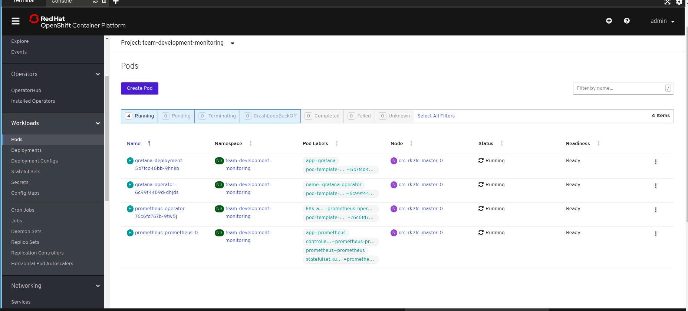
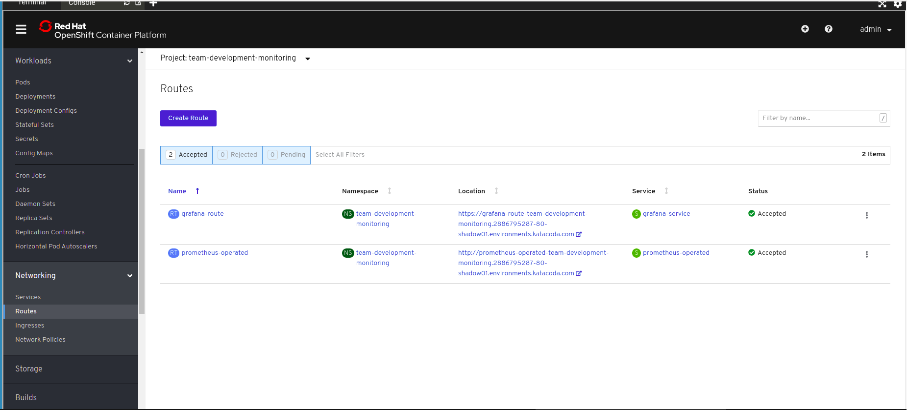
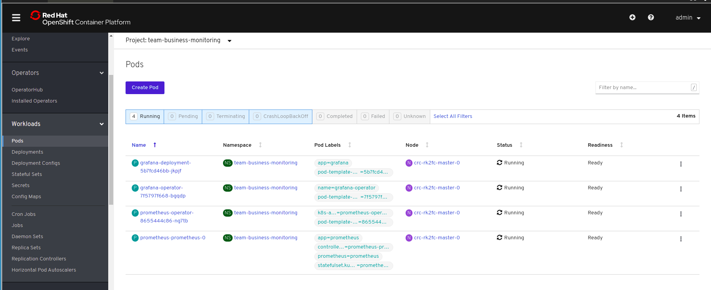
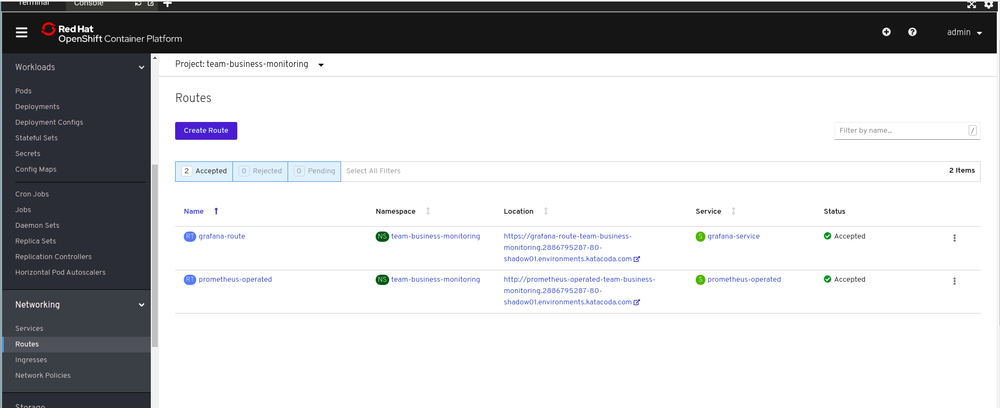
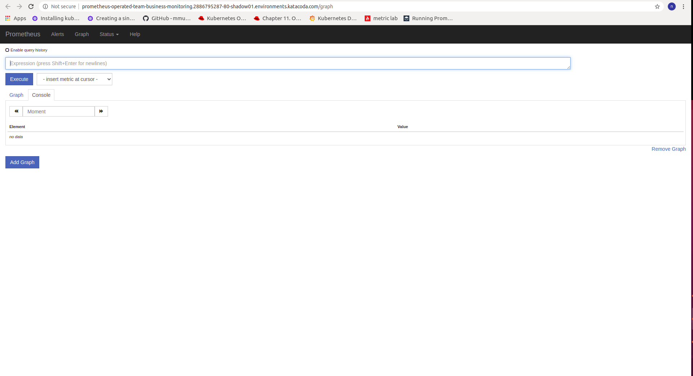
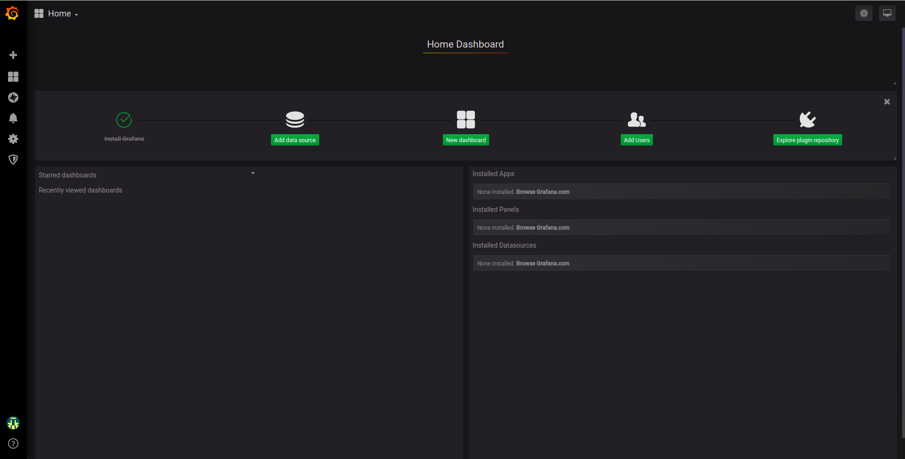

# monitoring-operator

DockerHub cleaning-operator image url:

https://hub.docker.com/repository/docker/nlaaziz/monitoring-operator


Monitoring-operator helps create supervision stacks for multiple teams. Each team
will be able to monitor its own applications separately.

Each team will have its own monitoring namespace, in which, a prometheus and grafana operators
are deployed. Then instances of grafana and prometheus are created and can be exposed to access
team application metrics.

This project is still in developement.

## Monitoring Custom Ressource Definition

The custom resource definition 'monitoring' helps give team specifications to the operator.
Such as, teamName, monitoringNamespace name ...

## USAGE

#### Create Monitoring resource for two teams:

###### team-business

```
apiVersion: monitoring.com/v1alpha1
kind: Monitoring
metadata:
  name: team-business-monitoring
spec:
  teamName: team-business
  monitoringNamespace: team-business-monitoring
  grafana:
    installType: operator
    exposeRoute: true
  prometheus:
    installType: operator
    exposeRoute: true

```

###### team-development

```
apiVersion: monitoring.com/v1alpha1
kind: Monitoring
metadata:
  name: team-development-monitoring
spec:
  teamName: team-development
  monitoringNamespace: team-development-monitoring
  grafana:
    installType: operator
    exposeRoute: true
  prometheus:
    installType: operator
    exposeRoute: true

```

```
$ oc create -f team_developement.yaml
monitoring.monitoring.com/team-development-monitoring created
$ oc create -f team_business.yaml
monitoring.monitoring.com/team-business-monitoring created
$ oc get monitorings.monitoring.com
NAME                          AGE
team-business-monitoring      4s
team-development-monitoring   21s
```

#### A monitoring namespaces associated to each team are created

```
$ oc get project team-business-monitoring
NAME                       DISPLAY NAME   STATUS
team-business-monitoring                  Active
$ oc get project team-development-monitoring
NAME                          DISPLAY NAME   STATUS
team-development-monitoring                  Active
```

#### In monitoring namespaces, grafana and prometheus are deployed separately

###### Team development:

operators:



routes:



###### Team business:

operators:



routes:




###### Each team has its own grafana and prometheus accessible via routes:





#### When deploying applications, each team should add these labels to their services:

Team-business for example, labels are:

```
monitoring: 'true'
teamName: team-business
```

```
apiVersion: v1
kind: Service
metadata:
  name: service-business-app
  labels:
    monitoring: 'true'
    teamName: team-business
spec:
  selector:
    app: business-app
  ports:
    - protocol: TCP
      port: 80
      targetPort: 9376
```

### TODO:
Give users full ability to create CRDs for grafana and prometheus operators through monitoring CRD, such as: ServiceMonitors, Alertmanager, GrafanaDashboard, GrafanaDatasource

see CRDs prometheus for more details:

https://github.com/openshift/prometheus-operator#customresourcedefinitions

see CRDs grafana for more details:

https://github.com/integr8ly/grafana-operator#supported-custom-resources
